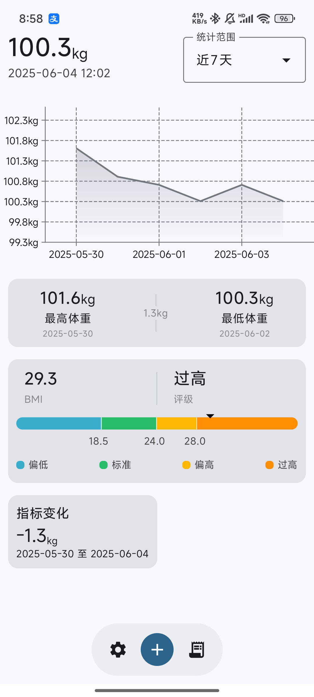

# WeightWise
WeightWise 是一款基于 Jetpack Compose 构建的开源 Android 应用，旨在帮助您轻松追踪和了解您的体重数据。这款直观的应用超越了简单的记录功能，提供强大的功能，让您直观地了解体重进展，并保持更健康的生活方式。

## 主要功能

* **轻松记录体重：** 快速方便地记录您的体重数据。
* **体重历史记录：** 以清晰的列表形式查看您所有的体重记录。
* **体重趋势图表：** 通过直观的图表观察您的体重变化趋势。
* **BMI 计算器：** 根据您的身高和体重计算身体质量指数 (BMI)。

## 截图

  

## 下载

您可以从以下渠道下载 WeightWise：

* **[GitHub Releases](链接到您的GitHub Releases页面)**

## 技术栈

* **Kotlin:** 作为主要的编程语言。
* **Jetpack Compose:** 用于构建现代化的声明式 UI。
* **Coroutines & Flow:** 用于异步编程和数据流管理。
* **Room:** 用于本地数据持久化。
* **Hilt:** 用于依赖注入。
* **Material3 for Compose:** 提供 Material Design3 风格的 UI 组件。
* **Vico:** 用于绘制体重趋势图表。

## 如何贡献

我们欢迎各种形式的贡献！

您可以：

* **报告 Bug：** 如果您发现了任何问题，请在 [Issues](链接到您的GitHub Issues页面) 中提交。
* **提出功能建议：** 如果您有新的想法，欢迎在 [Issues](链接到您的GitHub Issues页面) 中提出。
* **提交代码：** 如果您修复了 Bug 或实现了新功能，请提交 Pull Request。
* **翻译：** 帮助我们将应用翻译成更多语言。

## 许可证

WeightWise 在 [Apache License 2.0](/LICENSE) 下授权。

---

**感谢您使用 WeightWise！希望这款应用能帮助您更好地管理体重，拥抱健康生活！**