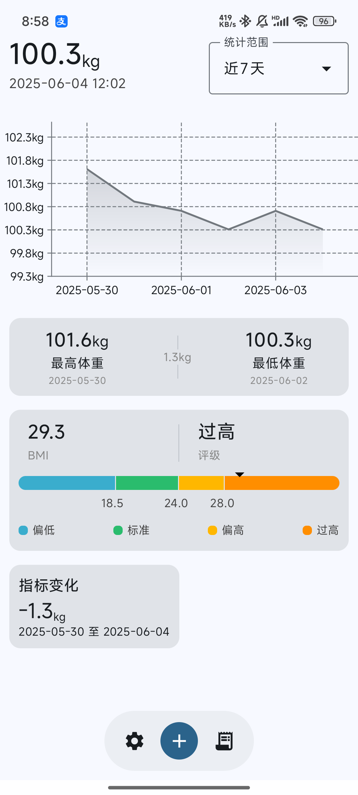

<p align="center">
  <h1 align="center">WeightWise</h1>
  <p align="center">基于 Jetpack Compose 的 Android 体重追踪与健康运动管理应用</p>
</p>

---

## 主要功能

- **体重记录** — 快速方便地记录每日体重数据
- **历史记录** — 以分页列表形式浏览所有体重记录，支持按日期排序
- **趋势图表** — 通过 Vico 图表库直观展示体重变化趋势（折线图 + 面积填充）
- **BMI 计算器** — 根据身高和体重自动计算身体质量指数 (BMI)
- **AI 运动计划** — 基于 DeepSeek 大模型生成个性化每日运动方案，支持 SSE 流式输出
- **运动偏好** — 支持黑名单/白名单标签过滤，场景筛选（室内/户外/办公），难度自动调节
- **体重分析** — AI 智能分析体重趋势，提供健康建议

## 截图

<p align="center">
  
</p>

## 下载

从 [GitHub Releases](https://github.com/Caleb-Rainbow/WeightWise/releases) 下载最新版本 APK。

## 环境要求

| 项目 | 版本 |
|------|------|
| JDK | 21 |
| Android SDK | compileSdk 36 / minSdk 29 / targetSdk 36 |
| Kotlin | 2.3.20 |
| Gradle | 8.13 |
| NDK | arm64-v8a |

## 构建与运行

```bash
# 构建 Debug APK
./gradlew assembleDebug

# 构建 Release APK（已启用代码混淆和资源压缩）
./gradlew assembleRelease

# 运行单元测试
./gradlew test

# 运行设备测试
./gradlew connectedAndroidTest

# 生成 Baseline Profile
./gradlew :app:generateBaselineProfile
```

> **注意：** 项目使用 `secrets.properties` 管理 API Key（已通过 `.gitignore` 排除），构建前需参考 `local.defaults.properties` 配置 DeepSeek API Key。

## 技术栈

| 类别 | 技术 |
|------|------|
| 语言 | Kotlin |
| UI 框架 | Jetpack Compose + Material3 (Material Expressive) |
| 导航 | Navigation3 (`androidx.navigation3`) |
| 依赖注入 | Koin 4.2 + Koin Annotations (KSP) |
| 本地存储 | Room 4（自动迁移）+ MMKV（偏好设置） |
| 网络 | Ktor + OkHttp（SSE 流式请求） |
| 图表 | Vico 3.x |
| 分页 | Paging 3 |
| 序列化 | kotlinx.serialization |
| 构建工具 | Gradle 8.13 + Version Catalog |

## 架构

采用 MVVM 架构（无独立 Domain 层），业务逻辑位于 ViewModel 和数据对象中。

```
app/src/main/java/com/example/weight/
├── ui/                          # 表现层
│   ├── main/                    # 首页（体重记录、BMI、分析）
│   ├── record/                  # 历史记录页
│   ├── setting/                 # 设置页
│   ├── exercise/                # 运动计划页
│   ├── common/                  # 公共 UI 组件
│   └── theme/                   # 主题、颜色、图标
├── data/                        # 数据层
│   ├── record/                  # 体重记录实体与 DAO
│   ├── exercise/                # 运动计划、目录、难度调节
│   ├── chat/                    # AI 对话（DeepSeek API）
│   ├── AppDataBase.kt           # Room 数据库
│   └── LocalStorageData.kt      # MMKV 偏好存储
├── util/                        # 工具类（时间处理，北京时间）
└── MainActivity.kt              # 入口 Activity + 导航定义
```

## 运动计划系统

运动计划功能采用多层降级策略：

1. **AI 生成** — 通过 DeepSeek API 根据用户数据生成个性化运动方案
2. **本地回退** — 内置 `ExerciseCatalog`，包含 23 个动作（3 个难度等级）
3. **偏好过滤** — 支持黑名单/白名单标签、场景筛选（室内/户外/办公）
4. **难度调节** — 根据用户体能水平自动调整运动难度

## 如何贡献

欢迎各种形式的贡献：

- **报告 Bug** — 在 [Issues](https://github.com/Caleb-Rainbow/WeightWise/issues) 中提交
- **功能建议** — 在 [Issues](https://github.com/Caleb-Rainbow/WeightWise/issues) 中提出新想法
- **提交代码** — 提交 Pull Request 修复 Bug 或实现新功能
- **翻译** — 帮助将应用翻译成更多语言

## 许可证

[Apache License 2.0](LICENSE)