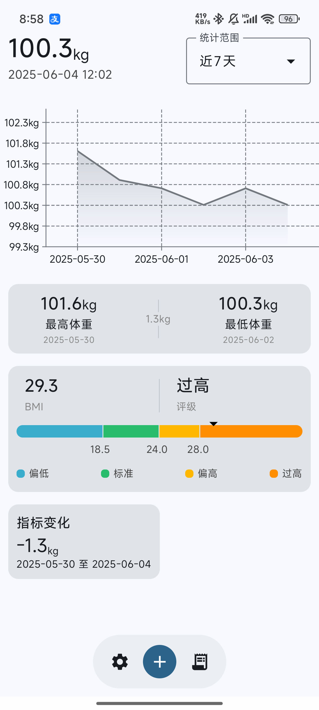

<p align="center">
  <h1 align="center">WeightWise</h1>
  <p align="center">基于 Jetpack Compose 的 Android 体重追踪与饮食记录应用</p>
</p>

---

## 主要功能

- **体重记录** — 快速方便地记录每日体重数据，支持备注日志、编辑与删除
- **历史记录** — 分页浏览全部体重记录，支持按日志内容或日期搜索（如 `08-20`、`2026-08`）
- **趋势图表** — 通过 Vico 图表库直观展示体重变化趋势（每日最低体重口径，折线图 + 面积填充），支持近 7 天 ~ 近 3 年 8 档统计范围
- **目标追踪** — 设置目标体重后展示进度条，基于近 90 天加权回归趋势预测达成目标还需多少天
- **连续打卡** — 首页展示连续打卡天数徽章，每累计减重 2kg 达成里程碑并庆祝
- **每日提醒** — WorkManager 定时提醒称体重，点通知直达记体重对话框
- **桌面小组件** — Glance 实现，展示当前体重、较 7 天变化与目标进度，点击直达记体重，响应式适配 2x2 / 4x2
- **数据备份** — JSON 全量导出/导入（去重合并、事务写入），另支持体重 CSV 导出
- **BMI 计算器** — 根据身高和体重自动计算身体质量指数 (BMI)，附健康区间解读
- **个人档案与热量建议** — 设置年龄、性别、活动水平后，按 Mifflin-St Jeor 公式估算基础代谢（BMR）与每日总消耗（TDEE），结合目标体重给出建议摄入；饮食页今日汇总升级为「已摄入/建议摄入」进度条，按个人热量余量红黄绿提示
- **AI 体重分析** — 基于豆包大模型（火山方舟）分析所选时间范围内的体重趋势，SSE 流式输出；融合时间范围内的每日热量摄入与个人档案，能解读「为什么这周体重涨了」
- **AI 饮食记录** — 拍照或文字描述识别食物、估算热量与宏量营养素，给出红绿灯评级；识别结果可手动增删改后保存，AI 不可用时自动回退本地估算

## 截图

<p align="center">
  
</p>

## 下载

从 [GitHub Releases](https://github.com/Caleb-Rainbow/WeightWise/releases) 下载最新版本 APK。

## 环境要求

| 项目 | 版本 |
|------|------|
| JDK | 21 |
| Android SDK | compileSdk 37 / minSdk 29 / targetSdk 36 |
| Kotlin | 2.4.10 |
| Gradle | 9.5 |
| NDK | arm64-v8a |

## 构建与运行

```bash
# 构建 Debug APK
./gradlew assembleDebug

# 构建 Release APK（已启用代码混淆和资源压缩）
./gradlew assembleRelease

# 运行单元测试
./gradlew test

# 运行设备测试
./gradlew connectedAndroidTest

# 生成 Baseline Profile
./gradlew :app:generateBaselineProfile
```

> **注意：** 项目使用 `secrets.properties` 管理 API Key（已通过 `.gitignore` 排除），构建前需参考 `local.defaults.properties` 配置豆包（火山方舟）API Key。

## 技术栈

| 类别 | 技术 |
|------|------|
| 语言 | Kotlin |
| UI 框架 | Jetpack Compose + Material3 (Material Expressive) |
| 导航 | Navigation3 (`androidx.navigation3`) |
| 依赖注入 | Koin 4.2 + Koin Annotations (KSP) |
| 本地存储 | Room（自动迁移）+ MMKV（偏好设置） |
| 网络 | Ktor + OkHttp（SSE 流式请求） |
| 图表 | Vico 3.x |
| 分页 | Paging 3 |
| 序列化 | kotlinx.serialization |
| 构建工具 | Gradle 9.5 + Version Catalog |

## 架构

采用 MVVM 架构（无独立 Domain 层），业务逻辑位于 ViewModel 和数据对象中。

```
app/src/main/java/com/example/weight/
├── ui/                          # 表现层
│   ├── main/                    # 首页（体重记录、图表、目标进度、BMI、AI 分析）
│   ├── record/                  # 历史记录页（分页、搜索、侧滑编辑/删除）
│   ├── diet/                    # 饮食记录页（拍照/文字识别、今日汇总）
│   ├── setting/                 # 设置页
│   ├── common/                  # 公共 UI 组件
│   └── theme/                   # 主题、颜色、图标
├── data/                        # 数据层
│   ├── record/                  # 体重记录实体与 DAO
│   ├── diet/                    # 饮食记录实体、DAO、Prompt 构建、离线兜底
│   ├── chat/                    # AI 对话（豆包/火山方舟，OpenAI 兼容协议）
│   ├── AppDataBase.kt           # Room 数据库
│   └── LocalStorageData.kt      # MMKV 偏好存储
├── util/                        # 工具类（时间处理、图片压缩、体重趋势预测）
└── MainActivity.kt              # 入口 Activity + 导航定义
```

## AI 能力与降级策略

- **体重分析**：将所选范围的体重与日志数据构建 Prompt，经豆包 API 流式生成三段式分析（阶段总结 / 数据洞察 / 行动建议）；请求失败在界面呈现错误态并支持重试。
- **饮食识别**：支持「照片 + 补充说明」多模态与纯文字两种输入，要求模型返回结构化 JSON（食物清单、热量、宏量、红绿灯、建议）；AI 不可用时回退 `FallbackDietAnalyzer` 给出按餐型的默认热量估算，并提示用户手动修正。

## 如何贡献

欢迎各种形式的贡献：

- **报告 Bug** — 在 [Issues](https://github.com/Caleb-Rainbow/WeightWise/issues) 中提交
- **功能建议** — 在 [Issues](https://github.com/Caleb-Rainbow/WeightWise/issues) 中提出新想法
- **提交代码** — 提交 Pull Request 修复 Bug 或实现新功能

## 许可证

[Apache License 2.0](LICENSE)
