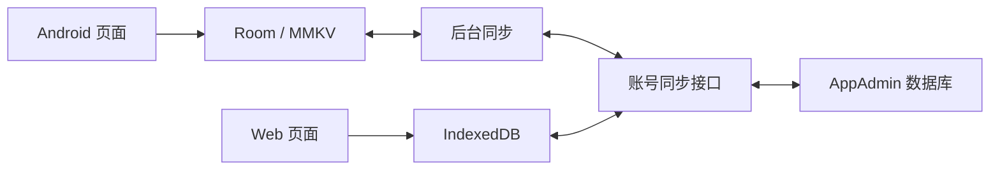

# 账号与离线同步

## 数据范围

- 体重、测量时间、日志、全部身体成分。
- 饮食日期、餐次、食物明细、热量、评级、说明、照片。
- 身高、年龄、性别、活动水平、目标、腰围、体脂目标，以及外观、提醒、AI 模型、统计口径设置。
- 报告、图表、常用食物、连续打卡等继续由本地记录计算。

账号凭证、设备标识、首次引导状态不作为用户业务数据同步。AI 推理与版本更新仍使用各自网络服务。

## 工作方式

页面和 ViewModel 只读写 Room/MMKV。每次业务修改与待同步标记一起落库；WorkManager 在联网时提交增量并拉取远端变化，再写回 Room。打开应用、手动同步、本地修改会安排同步，另有 15 分钟的后台任务兜底，失败指数退避重试。

这与 [Android 的离线优先数据层建议](https://developer.android.com/topic/architecture/data-layer/offline-first) 一致。



### 身份与隔离

- 使用 AppAdmin 的注册、验证码、登录接口，应用标识固定为 `com.example.weight`。
- JWT 绑定应用及用户；凭证使用 Android Keystore AES-GCM 加密后保存，不保存密码。
- 数据按 `ownerId` 隔离，查询、统计、分页、备份、小组件都只读取当前账号。切换账号同时销毁旧 ViewModel、草稿和导航状态。
- 未登录记录归本机空间，首次登录时绑定到所登录账号。退出后保留账号的本地数据及待同步修改，重新登录可继续同步。
- 登录过期/账号停用时暂停远端同步，本机记录可继续使用，界面提示重新登录。
- 调试时更换同步服务器会使用独立数据库，避免不同环境中相同数字用户 ID 混用数据。

### 重试与冲突

每条数据包含稳定随机 ID、服务端版本号、随机操作 ID 和删除标记。服务端按账号锁定版本时钟，并在事务中完成写入和增量读取。重复提交同一操作不重复建档；不依赖客户端时钟判断新旧。

并发修改采用版本校验：显示已提交的云端版本，将未提交的本机版本保存为冲突副本。设置页可恢复副本或保留云端版本。恢复记录会创建新记录；恢复设置或删除操作则基于当前版本重新提交。

删除保留墓碑，旧离线设备不能重新创建已删除记录。饮食撤销删除使用更新原行，保留同步 ID 与服务端版本。

### 照片

照片通过饮食同步负载传递，单张上限 3MB。服务端验证 JPEG/PNG/WebP；下载后保存到应用私有目录，使用账号、记录 ID 和内容哈希命名。本机照片缓存缺失时，编辑文字不会清除云端照片。当前实现将照片 Base64 存在业务数据表，适合当前规模；大量照片时可将此字段迁移为独立的对象存储引用。

## Web 体重模块

AppAdmin 侧边栏「体重记录」提供账号切换、增删改、日期/备注筛选、分页、每日最低体重趋势、目标线、BMI、CSV 导出、身体成分、饮食照片与个人档案。

Web 先保存 IndexedDB，再与相同同步协议交换数据。缓存按管理员、应用和用户隔离，跨标签页使用 IndexedDB 事务。Service Worker 缓存公开页面资源，首次在线访问后可断网刷新体重页面；API 响应不进入 Service Worker 缓存。后台每 30 秒及网络恢复时尝试同步。

首次登录和首次加载账号目录需要联网。清除浏览器站点数据会清除尚未同步的浏览器修改。

## 上线

1. 先部署 AppAdmin 修改，启动时自动创建 `weight_entries` 和 `weight_clocks`。
2. 确认应用管理已接入并启用 `com.example.weight`。
3. 构建并发布 Android。Room v13 → v14 原地迁移，历史记录标记为未绑定、待同步；不使用破坏性迁移兜底。
4. 用户在「设置 → 账号与数据同步」注册/登录。Web 从「体重记录」选择相同账号。

默认服务为 `https://app-admin.yingluozhiwei.cn`。本次开发测试使用独立的 `weightwise_sync_dev` 数据库和本机 18083 端口，未发布线上服务。

## 验证命令

```powershell
./gradlew.bat :app:testDebugUnitTest :app:assembleDebug
# 使用本机后端的独立调试包
./gradlew.bat :app:assembleDebug :app:assembleDebugAndroidTest -PsyncServerUrl=http://127.0.0.1:18083
adb -s 192.168.1.106:5555 reverse tcp:18083 tcp:18083
adb -s 192.168.1.106:5555 install -r app/build/outputs/apk/debug/app-debug.apk
adb -s 192.168.1.106:5555 install -r app/build/outputs/apk/androidTest/debug/app-debug-androidTest.apk
adb -s 192.168.1.106:5555 shell am instrument -w -e class com.example.weight.SyncDeviceTest -e runSyncE2e true -e syncUser TEST_USER -e syncSecondUser SECOND_TEST_USER -e syncPassword TEST_PASSWORD com.example.weight.debug.test/com.example.weight.SyncTestRunner
```

设备测试需事先在独立后端创建两个正式测试账号。未显式提供 `runSyncE2e=true` 或地址不是本机端口时跳过网络测试。测试使用独立 MMKV 目录和内存数据库，不读取真实账号记录。
